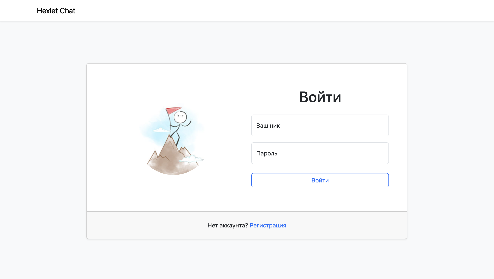
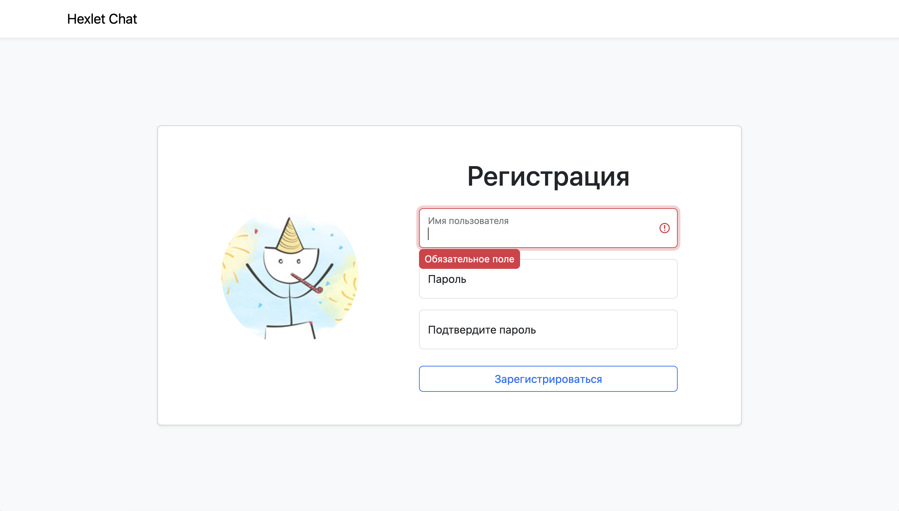
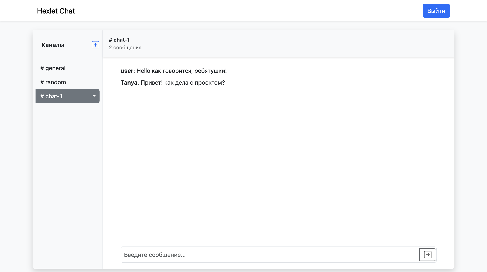
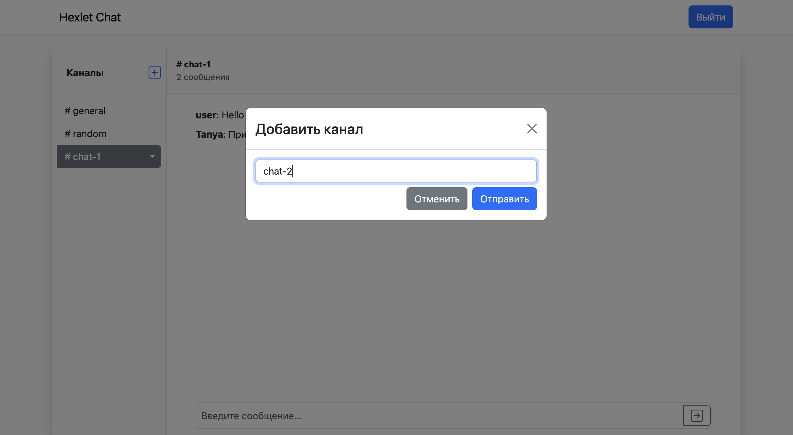

## Проект "Чат" ("Slack")

[](https://github.com/pavlovkeith/frontend-project-12/actions)
[](https://github.com/pavlovkeith/frontend-project-12/actions)
[](https://codeclimate.com/github/pavlovkeith/frontend-project-12/maintainability)

## Описание проекта
Минималистичная версия Slack, с базовыми функциями, такими как регистрация пользователей, создание, удаление и переименование каналов.


### Технический стек

- **React** — библиотека для построения пользовательского интерфейса.
- **Redux Toolkit** — управление состоянием приложения.
- **React Router** — для маршрутизации.
- **React-Bootstrap** — стилизация и готовые UI-компоненты.
- **i18next** — локализация приложения.
- **Webpack** — сборка фронтенд-приложения.
- **ESLint** — проверка качества кода.
- **GitHub Actions** — автоматизация тестирования и сборки.

## Использование
Используйте имеющийся аккаунт для проверки log: admin, pas: admin


Чтобы создать новый аккаунт кликните по сслыке регистрации внизу и создайте его


Создавайте новые каналы и отправляйте в них сообщения





## Установка

1. Склонируйте репозиторий:
```sh
git clone https://github.com/pavlovkeith/frontend-project-12.git
```

2. Перейдите в директорию проекта:
```sh
cd frontend-project-12
```

3. Установка зависимостей:
```sh
make install
```

4. Сборка проекта:
```sh
make build
```

5. Запуск:
```sh
make start
```

6. Откройте в браузере:
```sh
http://0.0.0.0:5001/
```

## Проект также доступен по следующей ссылке:

[Hexlet Chat на Render](https://frontend-project-12-ua2d.onrender.com) - **Посетите развернутую версию проекта на Render**
